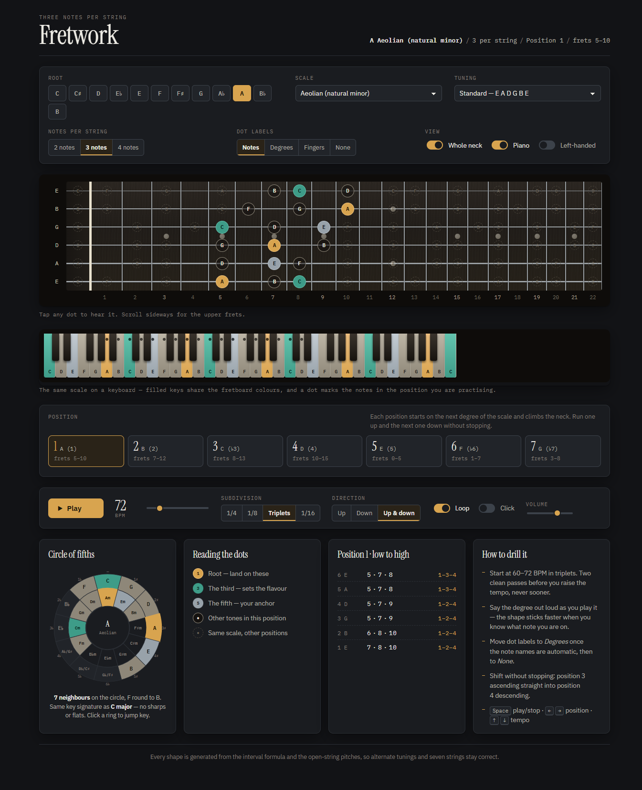

# Fretwork

An interactive guitar fretboard for practising **three-note-per-string** scales — plus a matching piano keyboard and a live circle of fifths, so you can see the same seven notes three ways at once.

One self-contained HTML file. No build step, no dependencies, no backend.



## What it does

**Fretboard** — 22 frets, six or seven strings, drawn with true scale-length fret taper. Dots are coloured by function: root, third, fifth, other scale tones. Notes outside the current position show as dashed ghosts so you can see where to shift next.

**3NPS positions** — one position per scale degree, each labelled with the note it starts on and its fret range. Switch to 2 notes per string for pentatonic boxes, or 4 for stretch work.

**Piano** — the same scale on a keyboard, sharing the fretboard's colours. A dot marks the notes in the position you're playing, and during playback the fretboard dot and the piano key light up together.

**Circle of fifths** — the scale's notes are highlighted in place, so you can see that a major scale is seven *adjacent* slices of the circle and that harmonic minor isn't. Reports the key signature, derived from the scale's own spelling. Click either ring to jump key.

**Playback** — plays the position with a Karplus–Strong plucked-string voice, following each note on both instruments. 40–220 BPM, quarters/eighths/triplets/sixteenths, up / down / up-and-down, loop, metronome. Click any dot or key to hear it alone.

**20 scales** — all seven major modes, harmonic and melodic minor, phrygian dominant, lydian dominant, altered, both pentatonics, minor and major blues, whole tone, both diminished scales, and chromatic.

**Chromatic mode** switches to the exercise people actually practise: a four-fret window on every string, one finger per fret, movable up the neck.

**Tunings** — standard, drop D, E♭/D standard, DADGAD, open G, open D, 7-string. Left-handed toggle.

Keyboard: <kbd>Space</kbd> play/stop · <kbd>←</kbd><kbd>→</kbd> position · <kbd>↑</kbd><kbd>↓</kbd> tempo.

## How the shapes are generated

Nothing is hard-coded. A position is built by walking the scale upward in pitch from its starting degree — each note's MIDI number is the previous one plus the next interval in the scale — then assigning notes to strings `n` at a time and converting to frets against the open-string pitches. Because the pitches are exact, only the octave of the whole shape is ever adjusted to fit the neck, and alternate tunings and seven-string necks stay correct for free.

Note names are spelled properly per key rather than picked from a chromatic list: each scale degree takes its own letter, with the accidental derived from the pitch class. F♯ lydian gives you A♯ and B♯, not B♭ and C.

Verified against the standard fingerings — C major position 1 comes out `8·10·12 / 8·10·12 / 9·10·12 / 9·10·12 / 10·12·13 / 10·12·13`, and A minor pentatonic at 2 notes per string reproduces the familiar boxes 1 and 2.

## Running it

Open `index.html` in a browser. That's the whole thing.

To serve it — for phones on your network, or behind a tunnel:

```bash
docker compose up -d
# http://localhost:3094
```

The only network request the page makes is the Google Fonts stylesheet; without it the page falls back to system fonts and everything still works.

## Licence

MIT — see [LICENSE](LICENSE).
